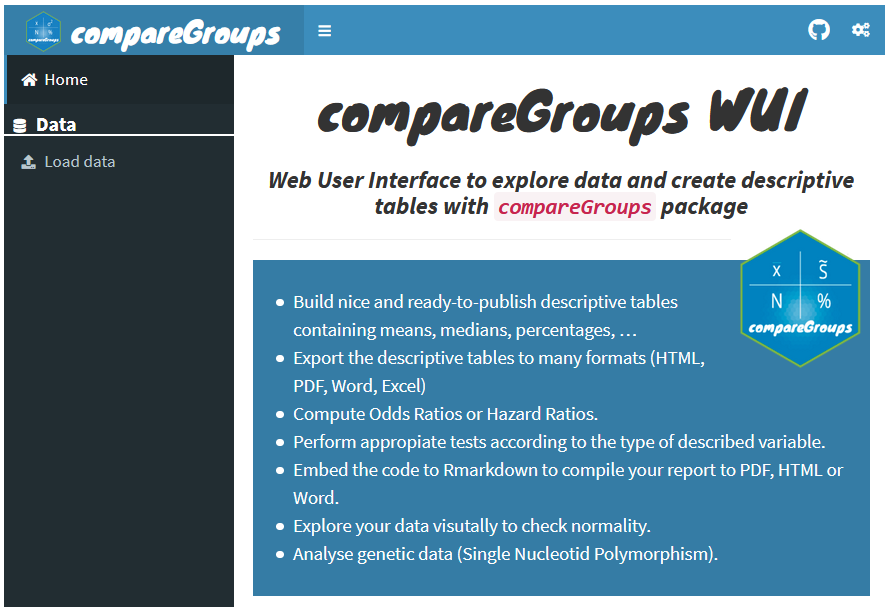

```{r global, include=FALSE}
# load data in 'global' chunk so it can be shared by all users of the dashboard
library(datasets)
library(tidyverse)
library(rhandsontable)
library(palmerpenguins)
library(Hmisc)
library(lubridate)
library(shinyWidgets)
library(formattable)
library(kableExtra)


# MAYUS <- palmerpenguins::penguins

# crear replicas de observaciones
# MAYUS <- dplyr::bind_rows(palmerpenguins::penguins,
#                           palmerpenguins::penguins[1:3,])
# dplyr::bind_rows(palmerpenguins::penguins,
#                  palmerpenguins::penguins[1:3,]) %>% 
#   readr::write_csv("palmer_test.csv")
MAYUS <- dplyr::bind_rows(outbreaks::ebola_sim_clean$linelist,
                          outbreaks::ebola_sim_clean$linelist[1:3,])
```

```{r}
updateUpload = reactive({
  
})

MAYUSRVE = reactive({

  if(is.null(input$hot)){MAYUS}
  else 
    if(!is.null(input$InputMAYUS)){read.csv(input$InputMAYUS$datapath)} 
  #%>% select(-X)
  else{
  hot_to_r(input$hot)
  }
})
```

PANELCONTROL {.sidebar}
===================================

<!-- Slider zone -->

```{r}
fileInput(inputId = "InputMAYUS",
          label = "Elige un archivo CSV",
          multiple = TRUE,
          accept = c("text/csv",
                     "text/comma-separated-values,text/plain",
                     ".csv"))
```

```{r,eval=FALSE}
actionButton(inputId = "apply", label = "Apply", icon = icon("play"))
observeEvent(eventExpr = input$apply, 
  handlerExpr = {
      req(input$file1)
      file <- read_csv(input$file1$datapath)
      rv$data <- file
  }, ignoreNULL = FALSE)
```


<!-- Slider zone -->

```{r}

renderUI({
  pickerInput(inputId = 'columntoselect',
            label = 'Columnas a seleccionar', 
            choices = colnames(MAYUSRVE()),
            options = list(`actions-box` = TRUE),
            multiple = T, 
            selected = colnames(MAYUSRVE())
            )
})

renderUI({
  pickerInput(inputId = 'columntofilter',
            label = 'Columna a filtrar', 
            choices = colnames(MAYUSRVE()),
            options = list(`actions-box` = TRUE),
            multiple = F, 
            selected = colnames(MAYUSRVE())[1]
            )
})

```

```{r}
renderUI({
  pickerInput(inputId = 'optionstofilter',
              label = 'Categorias a filtrar', 
              choices = MAYUSRVE() %>% 
                dplyr::select(input$columntofilter) %>%
                unique() %>% 
                rownames_to_column() %>% 
                pivot_wider(names_from = input$columntofilter,
                            values_from = rowname) %>% 
                colnames()
              # count(input$columntofilter) %>%
                # pull(var = 1) %>% 
                # as.character()
              ,
            options = list(`actions-box` = TRUE),
            multiple = T, 
            selected = MAYUSRVE() %>% 
                dplyr::select(input$columntofilter) %>%
                unique() %>% 
                rownames_to_column() %>% 
                pivot_wider(names_from = input$columntofilter,
                            values_from = rowname) %>% 
                colnames()
            )
})
```


<!-- Slider zone -->

Descargar Base 
<!-- Editada -->

```{r}

downname <- str_c(Sys.time() %>% 
                    janitor::make_clean_names(),
                  "-edited.csv")

downloadButton(outputId = "StarWarsDownload", 
               label = "Star Wars Download")
downloadHandler(
  filename = function(){downname},
  # filename = function(){"Star_Wars_Download.csv"},
  content = function(file){
    write.csv(MAYUSRVE(), file)
  }
)
```

Datos
=====================================

<!-- Results zone -->

```{r}
output$hot = renderRHandsontable({
  rhandsontable(MAYUSRVE(), height = 550) %>%  hot_rows()
})
rHandsontableOutput("hot")
```


Buscar
===================================

<!-- Results zone -->

```{r}

# ref: https://www.youtube.com/watch?v=MBNdyRQIvE4

DT::renderDT({
  MAYUSRVE() %>% 
    select(input$columntoselect) %>% 
    # filter(!!rlang::sym(input$columntofilter) %in% 
    #          input$optionstofilter) %>%
    filter(magrittr::is_in(!!rlang::sym(input$columntofilter),
                           input$optionstofilter)) %>%
    mutate_if(.predicate = is.numeric,.funs = ~round(.x,2)) %>% 
    DT::datatable(
      options = list(
        language = list(
          url = '//cdn.datatables.net/plug-ins/1.10.11/i18n/Spanish.json'))) 
})

```

Control
====================================

```{r}
eess_data <- tibble::tribble(
  ~.codigo,	~.diresa,	~.red,	~.microred,	~.nombre,	
  ~.cat,	~.distrito,	~.depa,	~.prov,
  ~.atencion_mes,	~.madres,	
  ~.jefes_eess,	~.personal,
  "es010101001",	"Ancash",	"HUAYLAS SUR",	"CAJACAY",	"P.S. RAQUIA",	
  "I-1",	"Antonio Raymondi",	"Ancash",	"Bolognesi",	27,	9,	1,	1,
  "es010101002",	"Ancash",	"HUAYLAS SUR",	"CAJACAY",	"C.S. CAJACAY",	
  "I-3",	"Cajacay",	"Ancash",	"Bolognesi",	41,	14,	1,	1,
  "es010102005",	"Ancash",	"CONCHUCOS SUR",	"CHAVIN",	"P.S. MACHAC",	
  "I-1",	"Chavín de Huántar",	"Ancash",	"Huari",	29,	11,	1,	1,
  "es010102006",	"Ancash",	"CONCHUCOS SUR",	"CHAVIN",	
  "P.S. CHICHUCANCHA",	
  "I-1",	"Chavín de Huántar",	"Ancash",	"Huari",	25,	10,	1,	1,
  "es010102008",	"Ancash",	"CONCHUCOS SUR",	"CHAVIN",	"C.S. CHAVIN",	
  "I-3",	"Chavín de Huántar",	"Ancash",	"Huari",	152,	60,	1,	1,
  "es010102009",	"Ancash",	"CONCHUCOS SUR",	"CHAVIN",	"P.S. CHALHUAYACO",	
  "I-1",	"San Marcos",	"Ancash",	"Huari",	46,	21,	1,	1,
  "es010102010",	"Ancash",	"CONCHUCOS SUR",	"CHAVIN",	
  "P.S. SAN PEDRO DE PICHIU",	
  "I-1",	"San Marcos",	"Ancash",	"Huari",	30,	14,	1,	1,
  "es010103011",	"Ancash",	"CONCHUCOS SUR",	"SAN MARCOS",	
  "C.S. SAN MARCOS",	
  "I-3",	"San Marcos",	"Ancash",	"Huari",	192,	90,	1,	1,
  "es010103012",	"Ancash",	"CONCHUCOS SUR",	"SAN MARCOS",	
  "P.S. CARHUAYACO",	
  "I-1",	"San Marcos",	"Ancash",	"Huari",	81,	38,	1,	1,
  "es010103013",	"Ancash",	"CONCHUCOS SUR",	"SAN MARCOS",	
  "P.S. AYASH DE HUARIPAMPA",	
  "I-1",	"San Marcos",	"Ancash",	"Huari",	4,	2,	1,	1,
  "es010103014",	"Ancash",	"CONCHUCOS SUR",	"SAN MARCOS",	
  "P.S. HUARIPAMPA",	
  "I-1",	"San Marcos",	"Ancash",	"Huari",	26,	12,	1,	1,
  "es010103017",	"Ancash",	"CONCHUCOS SUR",	"SAN MARCOS",	
  "P.S. SANTA CRUZ DE PICHIU",	
  "I-1",	"San Pedro de Chana",	"Ancash",	"Huari",	61,	26,	1,	1,
  "es020101001",	"Piura",	"Bajo Piura",	"Sechura",	
  "C.S. II Bellavista",	
  "I-2",	"Bellavista",	"Piura",	"Sechura",	32,	7,	1,	1,
  "es020101002",	"Piura",	"Bajo Piura",	"Sechura",	
  "P.S. II San Clemente",	
  "I-2",	"Bellavista",	"Piura",	"Sechura",	42,	9,	1,	1,
  "es020101003",	"Piura",	"Bajo Piura",	"Sechura",	"C.S. II Bernal",	
  "I-3",	"Bernal",	"Piura",	"Sechura",	85,	23,	1,	1,
  "es020101004",	"Piura",	"Bajo Piura",	"Sechura",	
  "P.S. II Cristo Nos Valga",	
  "I-2",	"Cristo Nos Valga",	"Piura",	"Sechura",	32,	14,	1,	1,
  "es020101006",	"Piura",	"Bajo Piura",	"Sechura",	
  "P.S. I Rinconada Llicuar",	
  "I-2",	"Rinconada de Llicuar",	"Piura",	"Sechura",	16,	10,	1,	1,
  "es020101007",	"Piura",	"Bajo Piura",	"Sechura",	"C.S. I Sechura",	
  "I-4",	"Sechura",	"Piura",	"Sechura",	121,	66,	1,	1,
  "es020101009",	"Piura",	"Bajo Piura",	"Sechura",	"P.S. I Parachique",	
  "I-1",	"Sechura",	"Piura",	"Sechura",	46,	25,	1,	1,
  "es020101011",	"Piura",	"Bajo Piura",	"Sechura",	
  "P.S. II La Bocana (de Sechura)",	
  "I-1",	"Sechura",	"Piura",	"Sechura",	54,	30,	1,	1,
  "es020101014",	"Piura",	"Bajo Piura",	"Sechura",	"C.S. II Vice",	
  "I-3",	"Vice",	"Piura",	"Sechura",	59,	29,	1,	1,
  "es020101015",	"Piura",	"Bajo Piura",	"Sechura",	"P.S. II Becara",	
  "I-2",	"Vice",	"Piura",	"Sechura",	63,	34,	1,	1,
  "es020101016",	"Piura",	"Bajo Piura",	"Sechura",	"P.S. II Letira",	
  "I-2",	"Vice",	"Piura",	"Sechura",	48,	24,	1,	1,
  
)

# eess_data %>% tibble::view()
# eess_data %>% select(.depa:.personal)
# eess_data
```

Row {data-height=80}
-------------------------------------

### Columna a filtrar

```{r}
renderUI({
  pickerInput(inputId = 'columntofiltercontrol',
              # label = '', 
            # label = 'Columna a filtrar', 
            choices = colnames(eess_data),
            options = list(`actions-box` = TRUE),
            multiple = F, 
            selected = colnames(eess_data)[2]
            )
})
```

### Categorias a filtrar

```{r}
renderUI({
  pickerInput(inputId = 'optionstofiltercontrol',
              # label = '', 
              # label = 'Categorias a filtrar', 
              choices = eess_data %>% 
                dplyr::select(input$columntofiltercontrol) %>%
                unique() %>% 
                rownames_to_column() %>% 
                pivot_wider(names_from = input$columntofiltercontrol,
                            values_from = rowname) %>% 
                colnames()
              # count(input$columntofilter) %>%
                # pull(var = 1) %>% 
                # as.character()
              ,
            options = list(`actions-box` = TRUE),
            multiple = T, 
            selected = eess_data %>% 
                dplyr::select(input$columntofiltercontrol) %>%
                unique() %>% 
                rownames_to_column() %>% 
                pivot_wider(names_from = input$columntofiltercontrol,
                            values_from = rowname) %>% 
                colnames()
            )
})
```


```{r}
eess_data_show <- eess_data
eess_data_show$.atencion_mes <- 
  color_tile("white", "orange")(eess_data_show$.atencion_mes)
eess_data_show$.madres <- 
  color_bar("lightgreen")(eess_data_show$.madres)
```

<!-- Column {.tabset} -->
Row {.tabset data-height=1500}
-------------------------------------

### Evaluar

```{r}

DT::renderDT({
  # MAYUSRVE() %>% 
    eess_data %>% 
    filter(magrittr::is_in(!!rlang::sym(input$columntofiltercontrol),
                           input$optionstofiltercontrol)) %>%
    # select(-.codigo) %>% 
    #remove department, province, district
    select(-.depa,-.prov,-.distrito) %>% 
    # rename_all(.funs = str_replace(.,"eess","")) %>% 
    mutate_if(.predicate = is.numeric,.funs = ~round(.x,2)) %>% 
    DT::datatable(
      options = list(
        language = list(
          url = '//cdn.datatables.net/plug-ins/1.10.11/i18n/Spanish.json'))) 
})
```


### Ver

```{r}
# renderText({
  eess_data_show %>% 
    # filter(magrittr::is_in(!!rlang::sym(input$columntofiltercontrol),
    #                        input$optionstofiltercontrol)) %>% 
    select(-.codigo) %>% 
    kable("html", escape = F) %>% 
    # kbl(eess_data, escape = F) %>%
    kable_styling("hover")
  # kable_paper("hover", full_width = F) %>%
  # column_spec(5, width = "3cm")
# })
```


Categóricas
=====================================

```{r}
renderPlot({
  d <- describe(
    MAYUSRVE() %>% 
      select(input$columntoselect) %>% 
      filter(magrittr::is_in(!!rlang::sym(input$columntofilter),
                             input$optionstofilter)))
  plot(d)$Categorical
})
```

Contínuas 
====================================

```{r}
renderPlot({
  d <- describe(
    MAYUSRVE() %>% 
      select(input$columntoselect) %>% 
      filter(magrittr::is_in(!!rlang::sym(input$columntofilter),
                             input$optionstofilter)))
  plot(d)$Continuous
})

```

Diccionario
==================================

Row {data-height=1000}
-------------------------------------

```{r}

renderUI({
  html(contents(
    MAYUSRVE() %>% 
      select(input$columntoselect) %>% 
      filter(magrittr::is_in(!!rlang::sym(input$columntofilter),
                             input$optionstofilter))), 
    maxlevels=10, levelType='table')
})

```


Detallado
=====================================

Row {.tabset}
-------------------------------------

### Is.Character

```{r}
library(rlang)

DT::renderDT({
  MAYUSRVE() %>% 
    select(input$columntoselect) %>% 
    filter(magrittr::is_in(!!rlang::sym(input$columntofilter),
                           input$optionstofilter)) %>% 
    select_if(.predicate = is.character) %>%
    skimr::skim() %>% 
    mutate_if(.predicate = is.numeric,.funs = ~round(.x,2)) %>% 
    DT::datatable(
      options = list(
        language = list(
          url = '//cdn.datatables.net/plug-ins/1.10.11/i18n/Spanish.json'))) 
})
```

### Is.Date

```{r}
DT::renderDT({
  MAYUSRVE() %>% 
    select(input$columntoselect) %>%
    filter(magrittr::is_in(!!rlang::sym(input$columntofilter),
                           input$optionstofilter)) %>% 
    select_if(.predicate = is.Date) %>%
    skimr::skim() %>% 
    mutate_if(.predicate = is.numeric,.funs = ~round(.x,2)) %>% 
    DT::datatable(
      options = list(
        language = list(
          url = '//cdn.datatables.net/plug-ins/1.10.11/i18n/Spanish.json'))) 
})
```

### Is.Logical

```{r}
DT::renderDT({
  MAYUSRVE() %>% 
    select(input$columntoselect) %>%
    filter(magrittr::is_in(!!rlang::sym(input$columntofilter),
                           input$optionstofilter)) %>% 
    select_if(.predicate = is.logical) %>%
    skimr::skim() %>% 
    mutate_if(.predicate = is.numeric,.funs = ~round(.x,2)) %>% 
    DT::datatable(
      options = list(
        language = list(
          url = '//cdn.datatables.net/plug-ins/1.10.11/i18n/Spanish.json'))) 
})
```


### Is.Numeric

```{r}
DT::renderDT({
  MAYUSRVE() %>%
    select(input$columntoselect) %>%
    filter(magrittr::is_in(!!rlang::sym(input$columntofilter),
                           input$optionstofilter)) %>% 
    select_if(.predicate = is.numeric) %>%
    skimr::skim() %>% 
    mutate_if(.predicate = is.numeric,.funs = ~round(.x,2)) %>% 
    DT::datatable(
      options = list(
        language = list(
          url = '//cdn.datatables.net/plug-ins/1.10.11/i18n/Spanish.json'))) 
})
```


Mixto
=====================================

```{r}

library(summarytools)

renderUI({
  print(dfSummary(
    MAYUSRVE() %>% 
      select(input$columntoselect) %>% 
      filter(magrittr::is_in(!!rlang::sym(input$columntofilter),
                             input$optionstofilter)),
    plain.ascii = FALSE, 
    style = "grid", 
    graph.magnif = 0.75, 
    valid.col = FALSE, 
    tmp.img.dir = "/tmp"), 
    method = 'render',
    headings = FALSE,
    bootstrap.css = FALSE)
})

```


Tabular
=====================================

Row {.tabset data-height=1000}
-----------------------------------------------------------------------

### Local

```{r}

renderPrint({
  compareGroups::compareGroups(
    formula = all ~ .,
    data = MAYUSRVE() %>% 
      select(input$columntoselect) %>% 
      filter(magrittr::is_in(!!rlang::sym(input$columntofilter),
                             input$optionstofilter)) %>% 
      mutate(all="TRUE")) %>% 
    compareGroups::createTable(show.p.overall = F)
})

```

### Web

#### link  {data-height=50}

__Use compareGroups__ http://www.comparegroups.eu/wui

#### figure 




Detectar
=====================================

Row {.tabset data-height=1000}
-----------------------------------------------------------------------


### Observaciones Duplicadas

Definidos como filas completas con los mismos valores para 
todas las variables incluidas.

__Advertencia:__ A menor número de variables incluidas, 
más duplicados se podrían encontrar.

```{r}
# data_input <- mdr_cases
# #number of raw and distinct observations
# nrow(data_input)
# nrow(distinct(data_input))

#which observations are replicates?
DT::renderDT({
  MAYUSRVE() %>% 
    select(input$columntoselect) %>%  
    filter(magrittr::is_in(!!rlang::sym(input$columntofilter),
                           input$optionstofilter)) %>% 
    group_by_all() %>% 
    filter(n()>1) %>% 
    # arrange(hash_short) %>%
    ungroup() %>% 
    DT::datatable(
      options = list(
        language = list(
          url = '//cdn.datatables.net/plug-ins/1.10.11/i18n/Spanish.json')))
})
```

### Valores Perdidos

Definidos como observaciones dentro de una variable sin valores.

```{r}
DT::renderDT({
  MAYUSRVE() %>% 
    select(input$columntoselect) %>% 
    filter(magrittr::is_in(!!rlang::sym(input$columntofilter),
                           input$optionstofilter)) %>% 
    naniar::miss_var_summary() %>% 
    mutate_if(.predicate = is.numeric,.funs = ~round(.x,2)) %>% 
    DT::datatable(
      options = list(
        language = list(
          url = '//cdn.datatables.net/plug-ins/1.10.11/i18n/Spanish.json')))
})
```

Definiciones
=====================================

__Observaciones Duplicadas__

Filas completas con los mismos valores para 
todas las variables incluidas.

__Valores Perdidos__

Observaciones dentro de una variable sin valores.

__Valores Inconsistentes__

Observaciones con valores que no son válidos cuando 
son comparados con otras variables.

__Valores Implausibles__

Observaciones con valores que no son válidos dentro
de los rangos plausibles en una determinada escala.


Acerca
=====================================

__Contacto__

Andree Valle Campos | 
[`@avallecam`](https://twitter.com/avallecam) |
avallecam@gmail.com

Enlace del proyecto: https://github.com/avallecam/followdash-qctest

__Agradecimientos__

Gracias al Centro Nacional de Epidemiología, Prevención y Control 
de Enfermedades [(CDC Perú)](https://www.dge.gob.pe/portalnuevo/)
por la oportunidad de trabajar en este proyecto.
